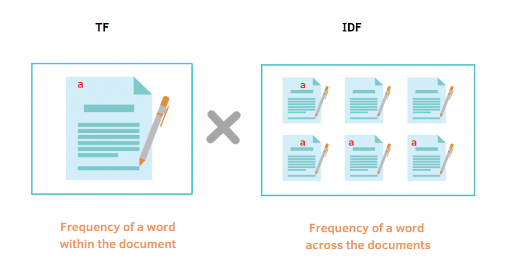
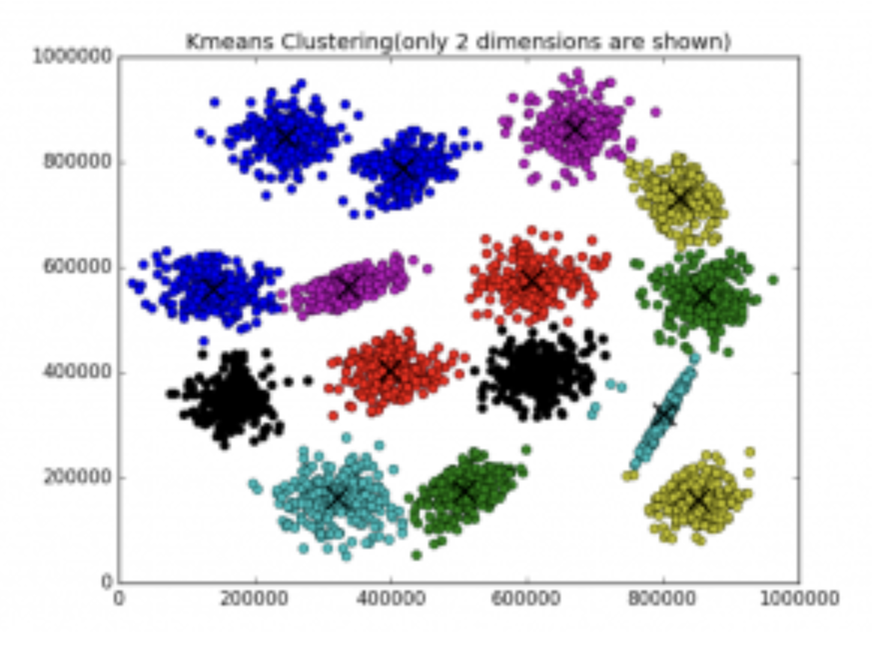
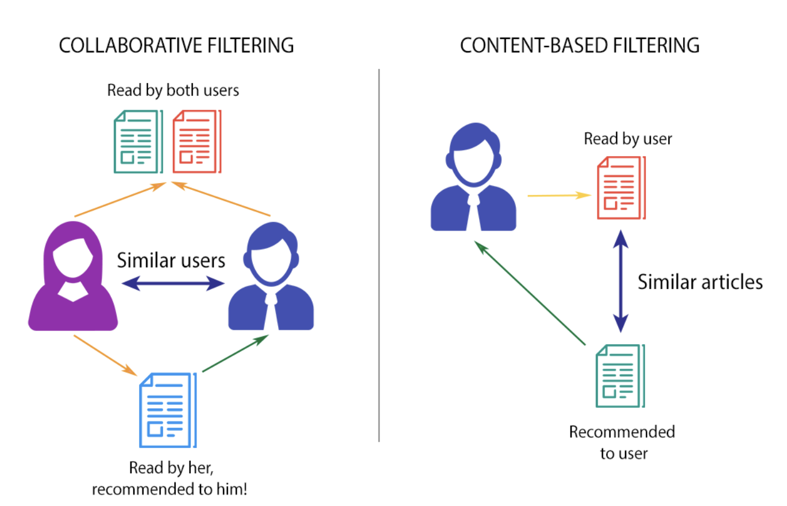

# Portfolio
---
## Machine Learning and Data Science

### EC ENGR 219: Large-Scale Data Mining: Models and Algorithms

The below section includes my implementation of assignments and projects in [***ECE219: Large-Scale Data Mining: Models and Algorithms***](https://www.uclaextension.edu/engineering/course/large-scale-data-mining-models-and-algorithms-ec-engr-xlc-219) by UCLA (Spring, 2022).

---

**End-to-End Pipeline Classify News Articles:** Steps include feature extraction, dimensionality reduction, application of simple classification models, evaluation of the pipeline, and application of pre-trained models.

---

**Data Representations and Clustering:** Conversion of raw text data into feature representations and comparison of different clustering methods along with clustering metrics; additionally dimensionality reduction for visual representation of clusters

---

**Recommender Systems:** Comparison of collaborative filtering models based on user ratings of movies. Implementations include neighborhood-based and model-based collaborative filtering methods to predict user movie ratings, and metrics used to evaluate such methods.

---

© 2020 RohanMehta. Powered by Jekyll and the Minimal Theme.

